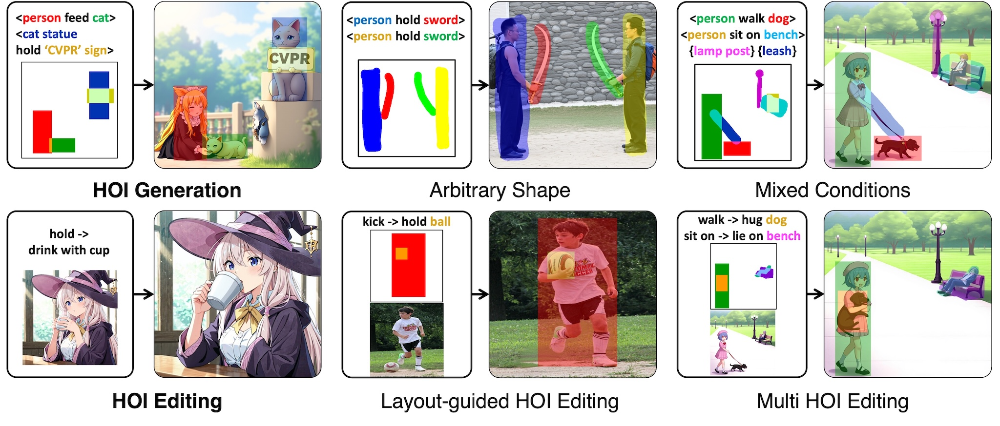

# OneHOI: Unifying Human-Object Interaction Generation and Editing

<p align="center">
  <a href="https://jiuntian.com/" target="_blank">Jiun Tian Hoe</a><sup>1</sup>,
  <a href="https://scholar.google.com/citations?user=zo6ni_gAAAAJ" target="_blank">Weipeng Hu</a><sup>1,2</sup>,
  <a href="https://personal.ntu.edu.sg/exdjiang/" target="_blank">Xudong Jiang</a><sup>1</sup>,
  <a href="https://vinuni.edu.vn/people/tan-yap-peng/" target="_blank">Yap-Peng Tan</a><sup>1,4</sup>,
  <a href="http://cs-chan.com" target="_blank">Chee Seng Chan</a><sup>3</sup>
</p>

<p align="center">
  <sup>1</sup>Nanyang Technological University &nbsp;
  <sup>2</sup>Sun Yat-sen University &nbsp;
  <sup>3</sup>Universiti Malaya &nbsp;
  <sup>4</sup>VinUniversity
</p>

<p align="center"><b>CVPR 2026 (Main)</b></p>

<p align="center">
  <a href="#">
    
  </a>
  &nbsp;
  <a href="https://github.com/jiuntian/OneHOI">
    
  </a>
  &nbsp;
  <a href="#">
    
  </a>
</p>

<p align="center">
  
</p>

**OneHOI** unifies Human-Object Interaction (HOI) generation and editing in a single, versatile model. It excels at challenging HOI editing, from text-guided changes to novel layout-guided control and novel multi-HOI edits. For generation, **OneHOI** synthesises scenes from text, layouts, arbitrary shapes, or mixed conditions, offering unprecedented control over relational understanding in images.


## 📰 News

- **[2026/02]** 🎉 OneHOI is accepted to **CVPR 2026**!
- **[2026/02]** 🌐 Project page is live!

## ✅ TODO

- [ ] Release paper on arXiv
- [ ] Release inference code and pretrained models
- [ ] Release HOI-Edit-44K dataset
- [ ] Release training code

## Abstract

Human-Object Interaction (HOI) modelling captures how humans act upon and relate to objects, typically expressed as ⟨person, action, object⟩ triplets. Existing approaches split into two disjoint families: HOI generation synthesises scenes from structured triplets and layout, but fails to integrate mixed conditions like HOI and object-only entities; and HOI editing modifies interactions via text, yet struggles to decouple pose from physical contact and scale to multiple interactions. We introduce **OneHOI**, a unified diffusion transformer framework that consolidates HOI generation and editing into a single conditional denoising process driven by shared structured interaction representations. At its core, the Relational Diffusion Transformer (R-DiT) models verb-mediated relations through role- and instance-aware HOI tokens, layout-based spatial Action Grounding, a Structured HOI Attention to enforce interaction topology, and HOI RoPE to disentangle multi-HOI scenes. Trained jointly with modality dropout on our HOI-Edit-44K, along with HOI and object-centric datasets, **OneHOI** supports layout-guided, layout-free, arbitrary-mask, and mixed-condition control, achieving state-of-the-art results across both HOI generation and editing.


## Related Links

- [InteractDiffusion (CVPR 2024): Interaction Control in Text-to-Image Diffusion Models](https://jiuntian.github.io/interactdiffusion/)
- [InteractEdit: Zero-Shot Editing of Human-Object Interactions in Images](https://jiuntian.github.io/interactedit/)
- [FLUX.1 Kontext](https://bfl.ai/models/flux-kontext)


## Citation

If you use our work in your research, please cite:

```bibtex
@inproceedings{hoe2026onehoi,
  title={OneHOI: Unifying Human-Object Interaction Generation and Editing},
  author={Hoe, Jiun Tian and Hu, Weipeng and Jiang, Xudong and Tan, Yap-Peng and Chan, Chee Seng},
  booktitle={Proceedings of the IEEE/CVF Conference on Computer Vision and Pattern Recognition (CVPR)},
  year={2026}
}
```
